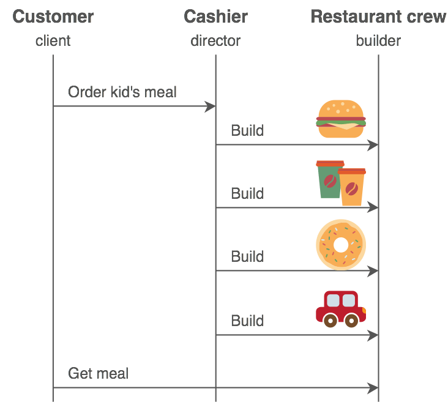

# Builder Design Patterns

1. [How does the Builder Design Pattern solve problems like URL creation?](https://youtu.be/4ff_KZdvJn8)
2. [The Builder Pattern Explained and Implemented in Java](https://youtu.be/MaY_MDdWkQw)
3. [Builder Design Pattern in detail with Code and Explanation](https://youtu.be/zAByFmRs6No) ⭐️
4. [Builder Design Pattern In Java](https://medium.com/javarevisited/builder-design-pattern-in-java-3b3bfee438d9)
5. [Explore different use cases for builder patterns in Java](https://www.initgrep.com/posts/design-patterns/when-to-use-builder-pattern)
6. [When should the builder design pattern be used?](https://softwareengineering.stackexchange.com/questions/341196/when-should-the-builder-design-pattern-be-used)

A creation design pattern **that lets you construct complex objects step by step**. The pattern allows you to produce different types and representations of an object using the same construction code.

Builder Pattern is designed to create the objects using a nested public static class that has the same data fields as the outer class.



## When to use Builder Patterns?

1. **Complex Object Construction:** If the object you're creating has a complex construction process with many parameters, the Builder pattern can help manage this complexity by breaking it down into a step-by-step process.
2. **Optional Parameters:** If the object has a mix of mandatory and optional parameters, the Builder pattern allows you to create the object with only the necessary parameters while making it easy to add optional ones.
3. **Immutable Objects:** If you need the final object to be immutable (i.e., its state cannot change after creation), the Builder pattern is ideal. The pattern allows you to set all required fields at construction time, ensuring that the object is fully initialized and immutable.
4. **Avoiding Telescoping Constructors:** If your class has constructors with many parameters (known as a telescoping constructor pattern), where different combinations of parameters lead to multiple constructors, the Builder pattern can simplify the design by consolidating all parameters into a builder.
5. **Complex Validation Logic:** If the creation of the object involves complex validation logic (e.g., certain parameters are required only if other parameters are set), the Builder pattern can encapsulate this logic within the builder, ensuring that the object is always in a valid state.

## When Not to Use the Builder Pattern?

1. Simple Objects: If the object has only a few parameters and the construction process is straightforward, the Builder pattern may be overkill and add unnecessary complexity.
2. Frequent Object Changes: If the object needs to be mutable and frequently changed after its creation, a different pattern or approach might be more appropriate.

## What is the Director class? When it’s needed?

The Director class in the Builder pattern is a helper or coordinator that constructs complex objects using a builder. It’s not always necessary but can be beneficial in specific scenarios. Here’s when you might need a Director class:

1.  You often need to create objects with predefined sets of attributes or configurations.
2. You have complex object creation processes where the order and specific configurations of setting attributes are important.
3. You want to separate the construction logic from the representation of the object.
4. The construction process involves several steps, and you want to simplify the client code.
5. You need to create different variations of an object, and each variation requires a specific set of steps or configuration.

## Structure

1. **Product**: The complex object that needs to be constructed.
2. **Builder Interface**: Declares the construction steps needed to create the product.
3. **Concrete Builder**:
    - Implements the Builder interface.
    - Provides specific implementations of the construction steps.
    - Maintains an instance of the product being built.
4. **Director**:
    - Manages the construction process.
    - Calls the builder's methods in a specific order to create the product.
    - The Director is optional and often used to encapsulate the construction logic.
5. **Client**:
    - Initiates the construction process.
    - May interact directly with the Builder or the Director.
    - Retrieves the final product from the Builder.

## Key Participants
1. Product: The complex object to be built.
2. Builder: Abstract interface to define building steps.
3. ConcreteBuilder: Implements the building steps.
4. Director (optional): Controls the construction process.
5. Client: Uses the builder to get the object.

## Example

Product (Car)
```java
public class Car {
    private String engine;
    private int wheels;
    private boolean airbag;

    // Private constructor to enforce use of Builder
    private Car(CarBuilder builder) {
        this.engine = builder.engine;
        this.wheels = builder.wheels;
        this.airbag = builder.airbag;
    }

    @Override
    public String toString() {
        return "Car [engine=" + engine + ", wheels=" + wheels + ", airbag=" + airbag + "]";
    }

    // Static nested Builder class
    public static class CarBuilder {
        private String engine;
        private int wheels;
        private boolean airbag;

        public CarBuilder setEngine(String engine) {
            this.engine = engine;
            return this;
        }

        public CarBuilder setWheels(int wheels) {
            this.wheels = wheels;
            return this;
        }

        public CarBuilder setAirbag(boolean airbag) {
            this.airbag = airbag;
            return this;
        }

        public Car build() {
            return new Car(this);
        }
    }
}
```
Client Code
```java
public class BuilderPatternDemo {
    public static void main(String[] args) {
        Car car = new Car.CarBuilder()
                        .setEngine("V8")
                        .setWheels(4)
                        .setAirbag(true)
                        .build();

        System.out.println(car);
    }
}
```
