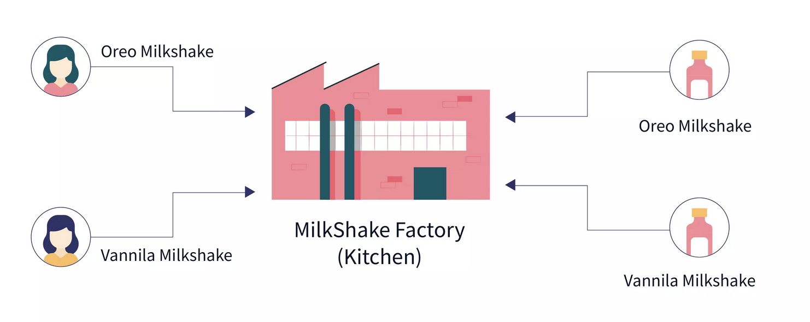

# Factory Design Pattern

The Factory design pattern is a creational design pattern that provides an interface for creating objects in a super class but allows subclasses to alter the type of objects that will be created. This pattern is used to encapsulate the object creation process, making it more flexible and reusable.

1. [How to use Factory Method Design Pattern](https://youtu.be/s3Wr5_tsODs)
2. [Factory Pattern Vs Abstract Factory Pattern Explanation](https://youtu.be/7g9S371qzwM)
3. [Factory Design Pattern: Implementation in Java](https://medium.com/@thecodebean/factory-design-pattern-implementation-in-java-bd16ebb012e2)
4. [Factory Design Pattern in Java](https://medium.com/@akshatsharma0610/factory-design-pattern-in-java-a77508c17e0d)



## Structure

| Component                              | Purpose                                | Example            |
| -------------------------------------- | -------------------------------------- | ------------------ |
| **Product Interface / Abstract Class** | Common type for products               | `Shape`, `Vehicle` |
| **Concrete Products**                  | Specific implementations               | `Circle`, `Car`    |
| **Factory Class**                      | Creates product objects                | `ShapeFactory`     |
| **Client Code**                        | Uses factory instead of `new` operator | `main()` method    |


## When to Use the Factory Pattern

1. When the exact type of object to be created isn’t known until runtime.
2. When the code needs to be flexible and extensible to support new object types without modifying the existing code.
3. When you want to delegate the responsibility of object creation to a separate class or method.
4. Promotes loose coupling by reducing the dependencies between the client and the actual classes used to instantiate objects.

## Factory Pattern Template

```java
// Step 1: Product interface
interface Product {
    void performAction();
}

// Step 2: Concrete product implementations
class ProductA implements Product {
    public void performAction() {
        System.out.println("Action from Product A");
    }
}

class ProductB implements Product {
    public void performAction() {
        System.out.println("Action from Product B");
    }
}

// Step 3: Factory class (stateless)
class ProductFactory {
    public static Product createProduct(String type) {
        switch (type.toLowerCase()) {
            case "a": return new ProductA();
            case "b": return new ProductB();
            default: throw new IllegalArgumentException("Unknown product type: " + type);
        }
    }
}

// Step 4: Client code
public class FactoryPatternDemo {
    public static void main(String[] args) {
        Product product1 = ProductFactory.createProduct("a");
        product1.performAction();

        Product product2 = ProductFactory.createProduct("b");
        product2.performAction();
    }
}

```

## Best Practices
1. Keep the factory stateless and only responsible for object creation. 
2. Always return the interface or abstract type, not the concrete class. 
3. Throw an exception or return null on invalid input (fail fast). 
4. Use enum instead of String for type safety if you can.

## Real-World Examples
| Use Case            | Interface      | Factory Class         | Concrete Implementations               |
| ------------------- | -------------- | --------------------- | -------------------------------------- |
| Drawing App         | `Shape`        | `ShapeFactory`        | `Circle`, `Rectangle`                  |
| Notification System | `Notification` | `NotificationFactory` | `EmailNotification`, `SMSNotification` |
| Hotel Booking       | `RoomType`     | `RoomFactory`         | `Economy`, `Deluxe`, `Luxury`          |
| Transport Service   | `Vehicle`      | `VehicleFactory`      | `Bike`, `Car`, `Bus`                   |

