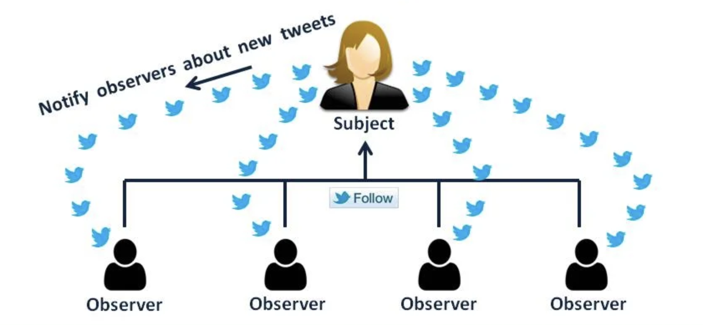

# Observer Design Pattern

The **Observer Design Pattern** is a behavioral design pattern that defines a one-to-many dependency between objects so that when one object (known as the **subject**) changes its state, all its dependent objects (known as **observers**) are automatically notified and updated. This pattern is useful when there is a need to maintain consistency between related objects without tightly coupling them.

1. [Observer Design Pattern in detail](https://youtu.be/o1YRkKq_y3c)
2. [Observer Design Pattern Explanation](https://youtu.be/Ep9_Zcgst3U)
3. [Observer Design Pattern — Explained In Five Minutes](https://medium.com/swlh/observer-design-pattern-explained-in-five-minutes-c01113666318)
4. [Observer Design Pattern](https://medium.com/@erlandmuchasaj/observer-design-pattern-67f05f42a083)



## Structure

1. **Subject (Observable):**
    - The object that holds the state and knows its observers.
    - Provides methods to attach (subscribe), detach (unsubscribe), and notify observers when there is a change in its state.
2. **Observer:**
    - An interface or abstract class defining a method to update the observer with new data when the subject's state changes.
    - Concrete observers implement this interface to receive updates from the subject.
3. **Concrete Subject:**
    - A class that implements the subject interface. It maintains the state of interest and sends notifications to observers when the state changes.
4. **Concrete Observer:**
    - A class that implements the observer interface to update its state in response to notifications from the subject.

| Role                 | Responsibility                                           |
| -------------------- | -------------------------------------------------------- |
| **Subject**          | Maintains list of observers and notifies them of changes |
| **Observer**         | Receives updates from subject                            |
| **ConcreteSubject**  | Implements state and notification logic                  |
| **ConcreteObserver** | Implements update behavior                               |


## When to Use

1. When a change in one object requires changes in others, and the number of objects that need to be changed is unknown.
2. When an object needs to notify other objects without knowing who those objects are.
3. When you want to establish a one-to-many relationship between objects, allowing loose coupling between them.

## Benefits

1. Loose Coupling: Reduces dependencies between the subject and observers, allowing changes to one without affecting the other.
2. Dynamic Subscription: Allows observers to be added or removed at runtime, providing flexibility in managing the list of observers.
3. Automatic Notification: Automatically informs all registered observers of state changes, ensuring real-time updates.
4. Enhanced Maintainability: Simplifies code maintenance by separating state management from the notification logic, leading to cleaner and more manageable code.
5. Scalability: Supports multiple observers, making it suitable for systems where a single event needs to be communicated to various components.

## Java Skeleton Template

```java
import java.util.*;

// 1. Observer Interface
interface Observer {
    void update(String message);
}

// 2. Subject Interface
interface Subject {
    void attach(Observer o);
    void detach(Observer o);
    void notifyObservers();
}

// 3. Concrete Subject
class NewsAgency implements Subject {
    private List<Observer> observers = new ArrayList<>();
    private String news;

    public void setNews(String news) {
        this.news = news;
        notifyObservers();
    }

    @Override
    public void attach(Observer o) {
        observers.add(o);
    }

    @Override
    public void detach(Observer o) {
        observers.remove(o);
    }

    @Override
    public void notifyObservers() {
        for (Observer o : observers) {
            o.update(news);
        }
    }
}

// 4. Concrete Observers
class NewsChannel implements Observer {
    private String name;

    public NewsChannel(String name) {
        this.name = name;
    }

    @Override
    public void update(String message) {
        System.out.println(name + " received update: " + message);
    }
}

// 5. Client Code (Demo)
public class ObserverPatternDemo {
    public static void main(String[] args) {
        NewsAgency agency = new NewsAgency();

        Observer channelA = new NewsChannel("Channel A");
        Observer channelB = new NewsChannel("Channel B");

        agency.attach(channelA);
        agency.attach(channelB);

        agency.setNews("Breaking News: Observer Pattern Implemented!");

        agency.detach(channelB);

        agency.setNews("Update: Observer Pattern is awesome!");
    }
}

```

## Best Practices
| Tip                                      | Why it Matters                            |
| ---------------------------------------- | ----------------------------------------- |
| Use **interface** for Observer & Subject | Promotes decoupling and flexibility       |
| Keep `notifyObservers()` separate        | Triggers only when state changes          |
| Prefer **List<Observer>** in Subject     | Easy to manage subscriptions              |
| Allow **detach()**                       | Enables dynamic unsubscribe               |
| Make Observers **stateless or reusable** | Reusability and clean behavior separation |


## Examples
| Use Case         | Subject         | Observers                 |
| ---------------- | --------------- | ------------------------- |
| Weather App      | Weather Station | Phone UI, Smartwatch, TV  |
| Stock Monitoring | Stock Market    | Traders, Brokers, Apps    |
| Chat App         | Chat Server     | Subscribed Users          |
| News Feed        | News Server     | News Clients (App, Email) |


