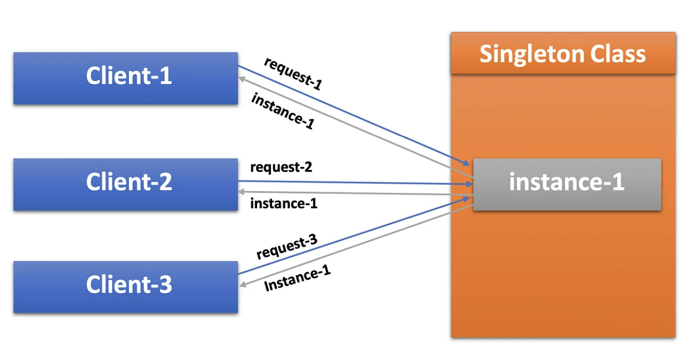

# Singleton Design Pattern

The Singleton Design Pattern is a creational design pattern that ensures a class has only one instance and provides a global point of access to that instance. This pattern is used when exactly one object is needed to coordinate actions across a system.

1. [How to BREAK and FIX Singleton Design Pattern](https://youtu.be/ASI0TfcY_7U)
2. [Story of Singleton Design Pattern and a Prime Minister](https://youtu.be/EZDeEHXUf8w)
3. [Singleton Design Pattern and 7 Ways to Implement it](https://blog.algomaster.io/p/singleton-design-pattern)
4. [Singleton Design Pattern: Implementation in Java](https://medium.com/@thecodebean/singleton-design-pattern-implementation-in-java-1fba4ecc959f)

## WHEN to Use Singleton

- You need to **share a single resource** (e.g. DB connection, Logger, Configuration).
- You want to **prevent redundant object creation**.
- You need **centralized state/control** in a system.

## Core Components

| Component | Description | Example |
| --- | --- | --- |
| **Private Constructor** | Prevents external instantiation | `private Singleton()` |
| **Static Instance** | Holds the single instance | `private static Singleton instance` |
| **Public Getter Method** | Provides global access point | `getInstance()` |

## Best Practices

| Do ✔ | Avoid ❌ |
| --- | --- |
| Use `private constructor` | Public constructors (breaks singleton) |
| Use `enum` or `static holder` for most cases | `synchronized` everywhere (performance hit) |
| Mark instance `volatile` in DCL | Over-engineering with unnecessary complexity |
| Handle serialization (if needed) | Allow reflection access (can break singleton) |

## Use Cases

- Logger
- Configuration Manager
- Cache Manager
- DB/Thread Pools
- Service Registry