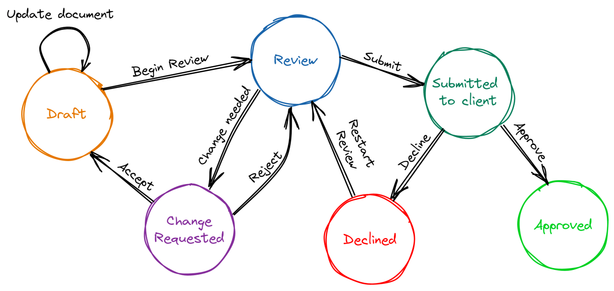

# State Design Pattern

The State Design Pattern is a behavioral design pattern that allows an object to change its behavior when its internal state changes. This pattern is used to encapsulate the behavior associated with a particular state in separate classes, allowing the object to switch between these states dynamically. The object appears to change its class.

1. [The State Pattern Explained and Implemented in Java](https://youtu.be/abX4xzaAsoc)
2. [State Design Pattern Use Case: Media Player Control](https://medium.com/@mehar.chand.cloud/state-design-pattern-use-case-media-player-control-691782fd6f8c)



## Structure

1. **Context**: This is the class that contains the current state of the object. It delegates the behavior to the current state object. The context maintains an instance of a state subclass that defines the current state.
2. **State Interface**: This defines the interface for the behavior associated with a particular state. All concrete states implement this interface, ensuring they provide specific implementations for state-specific behavior.
3. **Concrete State Classes**: These classes implement the state-specific behavior. Each class represents a specific state of the context, implementing methods from the state interface to reflect behaviors specific to that state.

| Role                  | Purpose                                 | Example                  |
| --------------------- | --------------------------------------- | ------------------------ |
| **Context**           | Maintains a reference to a state object | `VendingMachine`         |
| **State (interface)** | Common interface for all states         | `State`                  |
| **ConcreteState**     | Implements behavior for a state         | `IdleState`, `SoldState` |


## How It Works

1. The context maintains a reference to an instance of a state subclass, representing the current state.
2. The context forwards the requests to the state object.
3. The state object handles the request and can change the state in the context, if necessary, to reflect a transition to a different state.

## Benefits

1. **Encapsulation**: State-specific behavior is encapsulated in state classes, keeping the context class clean and focused on state management.
2. **Simplifies Maintenance**: Adding new states or changing existing ones is straightforward since states are isolated in their own classes.
3. **Flexibility**: The context can change its behavior dynamically by switching states, allowing for flexible and scalable design.

## State Design Pattern Skeleton
```java
// 1. State Interface
public interface State {
    void handle(Context context);
}

// 2. Concrete State A
public class ConcreteStateA implements State {
    @Override
    public void handle(Context context) {
        System.out.println("Handling logic in State A...");
        context.setState(new ConcreteStateB()); // transition if needed
    }
}

// 3. Concrete State B
public class ConcreteStateB implements State {
    @Override
    public void handle(Context context) {
        System.out.println("Handling logic in State B...");
        context.setState(new ConcreteStateA()); // transition if needed
    }
}

// 4. Context class
public class Context {
    private State currentState;

    public Context(State initialState) {
        this.currentState = initialState;
    }

    public void setState(State state) {
        this.currentState = state;
    }

    public void request() {
        currentState.handle(this);
    }
}

// 5. Client Code
public class Main {
    public static void main(String[] args) {
        Context context = new Context(new ConcreteStateA());

        context.request(); // Handles State A, transitions to B
        context.request(); // Handles State B, transitions to A
    }
}

```

## Best Practices

✔ Use when:

1. You have complex conditional logic based on state.
2. Behavior depends on current mode/state.
3. You want cleaner and extensible logic.

❌ Avoid when:

1. You have simple, infrequent state changes.
2. Overkill for trivial conditionals.

## Real-World Examples

| Scenario             | States                         |
| -------------------- | ------------------------------ |
| Media Player         | Playing, Paused, Stopped       |
| Document Workflow    | Draft, Moderation, Published   |
| Traffic Light System | Red, Green, Yellow             |
| ATM Machine          | Idle, CardInserted, Processing |
